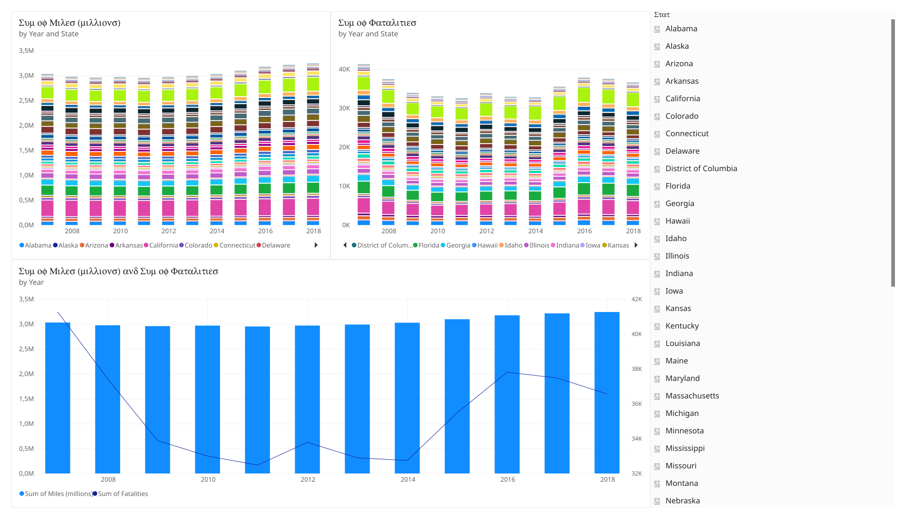

# 🚗 Lab 01: Driving & Road Safety Analysis

## 🎯 Overview & Objectives
This exercise focuses on combining multi-year traffic data from separate text files and folders using **Power Query**, and creating a **Line and Stacked Column Chart** in Power BI Desktop to analyze fatalities vs. miles traveled.

---

## 🔄 ETL & Power Query Steps
- **Data Merging:** Joined `Mileage2018` and `Fatalities2018` on `State` and `Year`.
- **Data Appending:** Combined multi-year datasets into a single query (`DrivingSafely2007-18`).
- **Folder Import:** Dynamically loaded and transformed an entire folder of historical `.txt` files.

---

## 📊 Visualizations & Formatting
- **Combo Chart:** Displays **Miles (Millions)** as columns and **Fatalities** as a line trend.
- **Line Interpolation:** Configured the line formatting to **Linear** (instead of Smooth) for accurate data representation without visual overshoot.
- **Slicer:** Added a State slicer for interactive filtering.

---

## 🖼️ Dashboard Preview

  

